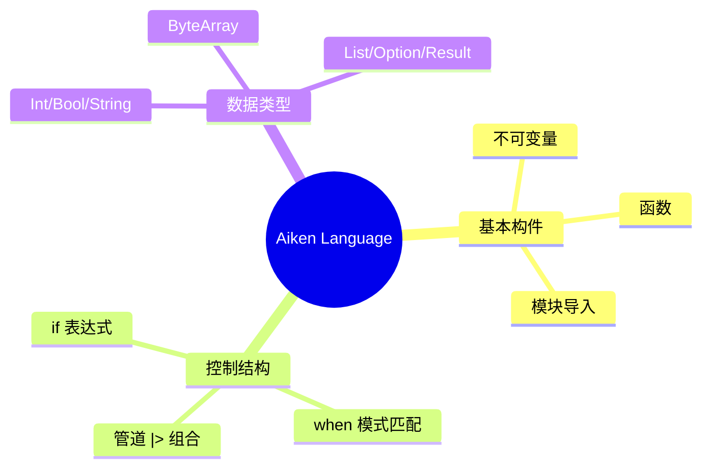

# 02 · Language Tour

站在“速查手册”的角度把 Aiken 语言的构成过一遍：表达式、函数、不可变量、模式匹配、常用类型。对标 WTF-Solidity 第 2 讲，但内容完全换成 Aiken + 函数式语法。

---

## 学习目标
1. 熟悉基础语法：不可变量、函数定义、模块导入、管道运算符。
2. 理解 `if` 与 `when ... is` 的语义差异，掌握模式匹配写法。
3. 了解常用内置类型（`Int`、`Bool`、`String`、`ByteArray`、`List`）和字面量表达方式。
4. 能在 `src/main.ak` 中写出 3~4 个纯函数，并通过 `aiken check`/`aiken test` 验证。

## 预备知识
- 已完成 01 讲，知道如何新建项目、运行 `aiken check`。
- 熟悉基本命令行操作，可使用自己喜欢的编辑器。
- 如果懂 Gleam/Elm/F#/OCaml，会发现语法非常眼熟；但即便没有相关背景，按本文练习也能快速上手。

## 开始前的贴士
| 步骤 | 命令/动作 | 说明 |
| --- | --- | --- |
| 打开终端 | `cd /Users/zekai/Documents/Cardano/Cardano-Aiken/02_LanguageTour` | 每一讲都是独立项目，必须先进入对应目录。 |
| 编译 + 运行测试 | `aiken check` | CLI 会自动搜寻 `src/` 与 `test/`，验证语法后执行断言。输出中若 `Summary` 显示 0 测试属正常（此讲以纯函数示例为主）。 |
| 生成 `plutus.json` | `aiken build --trace-level verbose` | 方便后续章节复用；因为本讲没有 validator，命令末尾会提示 “You do not have any validators to build!” ——这是预期的。 |

## 术语速览
| 术语 | 一句话解释 |
| --- | --- |
| **表达式** | 有返回值的语句块，例如 `if value < min { min }`。Aiken 中大部分结构都是表达式。 |
| **不可变量 (`let`)** | 只能定义一次，后续不能重新赋值。相当于 Rust/Elm 的 `let`。 |
| **模式匹配 (`when ... is`)** | 依照数据形态分支执行逻辑，比传统 `switch-case` 更强大。 |
| **Option / Result** | 安全处理“可能没有值”或“可能失败”的类型，避免到处写 `null`。 |
| **List API** | `list.map`、`list.fold` 等高阶函数，用来处理不可变列表。 |

---

## 1. Aiken 语法速览

| 语法元素 | 示例 | 说明 |
| --- | --- | --- |
| 不可变量 | `let message = "gm"` | `let` 定义后不可再赋值，符合纯函数理念。
| 函数定义 | `pub fn add(a: Int, b: Int) -> Int { a + b }` | `pub` 可选，导出模块外可见函数。
| 模块导入 | `use aiken/collection/list` | `use namespace/module`，可链式导入多个符号。
| 管道运算符 | `value |> func` | `x |> f` == `f(x)`，便于串联处理。
| 注释 | `/// 文档注释` / `// 单行注释` | `///` 会进入 docs。

> Aiken 没有循环、变量自增等命令式结构，大量使用递归、List API、mode 组合来处理数据。



---

## 2. 表达式与不可变量

打开 `02_LanguageTour/src/main.ak`，加入以下示例（仓库已提供基础代码，可直接扩展）：

```gleam
pub fn greet(name: String) -> String {
  let prefix = "Hello, "
  prefix <> name
}

pub fn clamp(value: Int, min: Int, max: Int) -> Int {
  if value < min { min }
  else if value > max { max }
  else { value }
}
```

- `let` 绑定只定义一次，若需要“修改”值，应该生成新的变量。
- 字符串拼接使用 `<>`（与 Gleam、Elm 一致）。
- `if` 是表达式，必须返回某个值；没有 `;`。 

运行 `aiken check` 确保语法正确。

> 延伸：`src/main.ak` 里还实现了 `greet_with_default(name: Option(String))`，演示如何用 `Option` 优雅地处理缺省值，练习题可直接调用它。

---

## 3. 模式匹配 (`when ... is`)

Aiken 鼓励一切逻辑以模式匹配表达，替代嵌套 `if` / `switch`。示例：

```gleam
pub type Message {
  Hello(String)
  Ping
  Numbered(Int)
}

pub fn describe(msg: Message) -> String {
  when msg is {
    Hello(name) -> "Hello, " <> name
    Ping -> "PONG"
    Numbered(value) -> "Number: " <> Int.to_string(value)
  }
}
```

- `type` 定义代数数据类型（Sum Type）。
- `when ... is { pattern -> expression }` 与 Rust/Elixir 类似。
- 模式可以解构 record、tuple、list，也可以使用 `_` 忽略值。

再加一个 pattern guard 的例子：

```gleam
pub fn classify(value: Int) -> String {
  when value is {
    v if v < 0 -> "negative"
    0 -> "zero"
    _ -> "positive"
  }
}
```

---

## 4. 常用内置类型与字面量

| 类型 | 字面量 & 常见 API | 用途 |
| --- | --- | --- |
| `Int` | `42`, `-1`, `0xFF` | 有符号 64 位整数。
| `Bool` | `True`, `False` | 条件表达式。
| `String` | `"gm"`, `"Hello"` | UTF-8 字符串；`<>` 拼接，`String.length` 获取长度。
| `ByteArray` | `#[FF00AA]` | 原始字节序列，常用于哈希、密钥。
| `List(T)` | `[1, 2, 3]` | 不可变列表；`list.map`, `list.fold`, `list.any` 等。
| `Option(T)` | `Some(value)` / `None` | 处理可选数据。
| `Result(Ok, Err)` | `Ok(value)` / `Error(reason)` | 表达可能失败的逻辑，18 讲会深入。

你可以在 `src/main.ak` 中添加以下示例来感受类型 API：

```gleam
use aiken/collection/list

pub fn average(values: List(Int)) -> Option(Int) {
  let count = list.length(values)
  let total = list.fold(values, 0, fn(acc, v) { acc + v })

  if count == 0 {
    None
  } else {
    Some(total / count)
  }
}
```

---

## 5. 交互式体验（可选）

Aiken 附带实验性的 REPL：
```bash
aiken repl
```
输入 `describe(Hello("Alice"))` 等表达式，即可查看执行结果。若 REPL 尚未稳定，可用 `aiken check --info` 查看类型推断信息，或在 `test/main.ak` 写断言。

示例测试（可在 `test/main.ak` 中添加）：

```gleam
use aiken/test
use cardano_aiken/lesson02.{average}

test fn average_of_list() {
  expect Some(2) = average([1, 2, 3])
}
```

执行：
```bash
aiken check
```
> CLI 会同时运行所有 `test fn ...`，因此无需额外 `--match` 参数。

---

## 6. 练习
| 练习 | 操作 | 验证方式 |
| --- | --- | --- |
| greet 升级 | 改写 `greet` 支持 `Option(String)`，默认 \"Anonymous\" | `aiken check` / 单元测试 `expect "Hello, Anonymous"` |
| List 累加 | 编写 `sum_positive(values: List(Int)) -> Int` | 在 `test/main.ak` 添加断言，`aiken check` 统一执行 |
| Pattern 扩展 | 为 `Message` 新增 `Goodbye(String)` 并更新 `describe` | `aiken check`; 可在测试中比较字符串输出 |

> 仓库中的 `greet_with_default`、`sum_positive`、`Message::Goodbye` 是参考答案，可动手完成后再对照。

---

## 7. 运行结果
| 命令 | 期望输出 |
| --- | --- |
| `aiken check` | `Compiling cardano-aiken/lesson02 ... Collecting all tests`（若 `Summary` 显示 0 测试属预期） |
| `aiken build --trace-level verbose` | `Generating project's blueprint (./plutus.json)` + `⚠ You do not have any validators to build!` |

实际终端输出示例（VS Code 终端或 macOS Terminal）：

```
$ cd /Users/zekai/Documents/Cardano/Cardano-Aiken/02_LanguageTour
$ aiken check
    Compiling cardano-aiken/lesson02 0.1.0 (.)
   Collecting all tests scenarios across all modules
$ aiken build --trace-level verbose
    Compiling cardano-aiken/lesson02 0.1.0 (.)
   Generating project's blueprint (./plutus.json)
  ⚠ You do not have any validators to build!
```

---

## 8. Troubleshooting
| 问题 | 可能原因 | 解决方案 |
| --- | --- | --- |
| `Undefined module aiken/collection/list` | CLI 版本过旧或未启用 stdlib | 升级 Aiken，确保 `use aiken/collection/list` 拼写正确 |
| `type mismatch` 相关错误 | `when` 分支返回类型不一致 | 所有分支必须返回同类型值；必要时加入默认分支 `_ -> ...` |
| `list.fold` 报错 | Lambda 参数顺序写反 | Aiken 的 `fn(acc, value)` 顺序固定，注意返回新累加值 |

---

## 9. 延伸阅读
- [Aiken 官方 Language Tour](https://aiken-lang.org/guide/language-tour.html)
- [Gleam Language Tour](https://gleam.run/book/tour/) — 语法风格相近，可以互通
- [Elm Pattern Matching](https://guide.elm-lang.org/core_language/patterns.html) — 帮助加深对匹配语义的理解

下一讲将探索类型与模式匹配的进阶用法：自定义 record/sum type、设计业务状态机。
