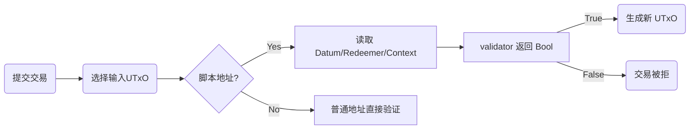

# 07 · Cardano & EUTxO

> 以图示方式理解 Cardano 交易生命周期：输入/输出、`datum`/`redeemer`/`context`，以及脚本如何读取这些数据。

---

## 学习目标
1. 理解账户模型 vs UTxO vs EUTxO 的差异与优势。
2. 认识交易输入（TxIn）、输出（TxOut）、脚本地址、Datum/Redeemer/Context 等概念。
3. 学会在 validator 中读取 `ScriptContext` 信息。

## 开始前贴士
| 步骤 | 命令/动作 | 说明 |
| --- | --- | --- |
| 打开目录 | `cd /Users/zekai/Documents/Cardano/Cardano-Aiken/07_CardanoAndEUTxO` |
| 运行 `check` | `aiken check`（会执行 `test/main.ak` 的示例） |
| 运行 `build` | `aiken build --trace-level verbose`（此讲没有 validator，看到警告属正常） |

## 本讲文件速览
| 文件/目录 | 作用 |
| --- | --- |
| `README.md` | 概念讲解、图示、练习与命令输出。 |
| `aiken.toml` | 声明包名 `cardano_aiken/lesson07`、Plutus 版本。 |
| `src/main.ak` | 读取 `ScriptContext` 并检查 `extra_signatories` 的示例。 |
| `test/main.ak` | 构造 Dummy Context，验证 `main` 在有/无 signer 时的行为。 |
| `plutus.json`、`build/…` | `aiken build` 输出（尽管本讲示例聚焦 Context，仍可用 CLI 生成）。 |

---

## 1. EUTxO 流程图


- **Datum**：随 UTxO 存储的状态。
- **Redeemer**：花费 UTxO 时提交的参数。
- **Context**：当前交易的全部信息（输入、输出、签名、时段等）。

---

## 2. `ScriptContext` 示例

`src/main.ak`
```gleam
use aiken/builtin.{Data}
use aiken/collection/list
use cardano/transaction.{ScriptContext}

/// 演示如何读取交易中的签名者数量。
pub fn main(_datum: Data, _redeemer: Data, context: ScriptContext) -> Bool {
  let signers = context.transaction.extra_signatories
  list.length(signers) > 0
}
```

---

## 3. 测试：构造 Dummy Context

`test/main.ak`
```gleam
use aiken/builtin.{Data}
use aiken/test
use cardano/transaction
use cardano_aiken/lesson07.{main}

fn dummy_context(extra: List(ByteArray)) -> transaction::ScriptContext {
  transaction::ScriptContext {
    purpose: transaction::ScriptPurpose::Spend(transaction::OutputReference::new(transaction::TxId(#[]), 0)),
    script_hash: #[],
    transaction: transaction::Transaction {
      extra_signatories: extra,
      ..transaction::Transaction::default()
    }
  }
}

test fn requires_signer() {
  let ctx = dummy_context([#[]])
  expect True = main(Data::Bytes(#[]), Data::Bytes(#[]), ctx)
}

test fn fails_without_signer() {
  let ctx = dummy_context([])
  expect False = main(Data::Bytes(#[]), Data::Bytes(#[]), ctx)
}
```

---

## 4. CLI 命令示例
```
$ cd /Users/zekai/Documents/Cardano/Cardano-Aiken/07_CardanoAndEUTxO
$ aiken check
    Compiling cardano_aiken/lesson07 0.1.0 (.)
   Collecting all tests scenarios across all modules
$ aiken build --trace-level verbose
    Compiling cardano_aiken/lesson07 0.1.0 (.)
   Generating project's blueprint (./plutus.json)
```
> `aiken build` 因为没有 validator 会提示警告，属于正常现象。

---

## 5. 练习
| 练习 | 操作 | 验证方式 |
| --- | --- | --- |
| 检查某个 TxOut | 在 `context.transaction.outputs` 中查找特定地址 | `aiken check` |
| 验证时间区间 | 读取 `context.transaction.valid_range`，决定是否允许花费 | `aiken check` |
| 统计输入 ADA | 使用 `cardano/value` 模块统计输入/输出金额 | `aiken check` |

---

## 6. Troubleshooting
| 问题 | 可能原因 | 解决方案 |
| --- | --- | --- |
| `unknown module cardano/transaction` | CLI 版本过旧 | 升级 Aiken（>= 1.0），或确保 `cardano` stdlib 在依赖列表中 |
| `type mismatch` | `dummy_context` 字段不完整 | 使用 `..Transaction::default()` 填充默认字段 | 
| `datum`/`redeemer` 未使用 | 若暂时不需要，可在参数名前加 `_` 避免警告 |

---

## 7. 延伸阅读
- [Cardano Docs: EUTxO 模型](https://docs.cardano.org/explore-cardano/eutxo-explainer)
- [Aiken 的 `cardano/transaction` 模块文档](https://aiken-lang.org/stdlib/cardano/transaction)

下一讲将正式使用 blueprint，把 Context 信息与 Lucid/Mesh 等前端工具对接。
